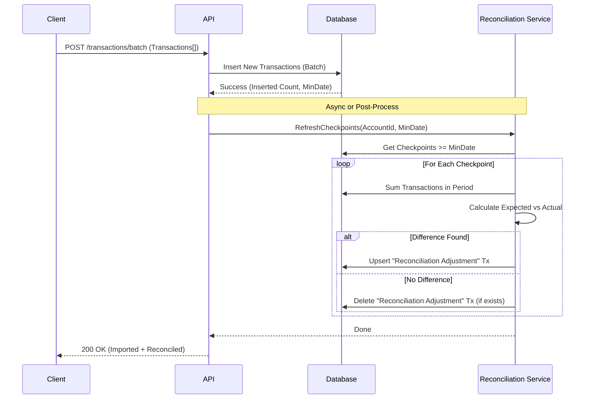

# Reconciliation Design Pattern

## Overview
This document outlines the design for handling retrospective reconciliation updates efficiently during batch transaction imports.

## Problem
When importing past transactions (e.g., from a bank statement), we might insert transactions into a period that has already been reconciled.
- **Current State**: The balance checkpoint for that period remains fixed, causing a discrepancy between the sum of transactions and the checkpoint balance.
- **Desired State**: The system should automatically detect this and update the "Adjustment Transaction" (or create one) for the affected reconciliation period to maintain the "plug".

## Proposed Solution: "Batch Reconciliation Refresh"

Instead of checking every single transaction during import (which is O(N)), we use a **Range-Based Refresh** strategy (O(M), where M is number of checkpoints).

### 1. The Import Flow
We introduce a new API endpoint or update the existing batch processor to handle this.



### 2. API Design

#### `POST /api/accounts/:accountId/transactions/batch`
**Request Body**:
```json
{
  "transactions": [ ... ]
}
```

**Response**:
```json
{
  "importedCount": 15,
  "reconciliationUpdates": {
    "checkpointsRefreshed": 2,
    "adjustmentsCreated": 1,
    "adjustmentsUpdated": 0
  }
}
```

### 3. Implementation Logic

#### Step A: Batch Insert
Insert transactions as usual. Keep track of the `minDate` of all *successfully inserted* (non-duplicate) transactions.

#### Step B: Identify Affected Checkpoints
Query `balance_checkpoints` for this account where `date >= minDate`.
- **Why?** Any checkpoint *after* an inserted transaction might now have an incorrect "Adjustment".
- **Optimization**: If `minDate` is after the latest checkpoint, no action is needed.

#### Step C: Recalculate Adjustments
For each affected checkpoint:
1.  **Define Period**:
    - `Start`: Date of previous checkpoint (or Epoch if none).
    - `End`: Date of current checkpoint.
2.  **Sum Transactions**: Calculate `Sum(Amount)` for all transactions in `(Start, End]`.
    - *Exclude* existing `RECONCILIATION` transactions for this checkpoint to avoid double counting.
3.  **Calculate Delta**:
    - `Expected = StartBalance + Sum`
    - `Delta = CheckpointBalance - Expected`
4.  **Upsert Adjustment**:
    - If `Delta != 0`: Create/Update a transaction of type `RECONCILIATION` with `amount = Delta` and `date = CheckpointDate`.
    - If `Delta == 0`: Delete existing `RECONCILIATION` transaction if it exists.

## Data Model Changes
-   **TransactionType**: Added `RECONCILIATION` enum value.
-   **Transaction**: `RECONCILIATION` transactions are auto-generated and managed by the service.
    -   **User Action**: Users may delete these transactions to "un-reconcile" a period. The system will recreate them if reconciliation is run again without fixing the underlying data gap.
    -   **Storage**: Must follow the **Dual-Write** pattern (create in nested account collection AND global user collection) to ensure visibility in all lists.

## Performance Considerations
- **Reads**: For each affected checkpoint, we need to sum transactions. This is a range query.
- **Writes**: Minimal (1 write per checkpoint max).
- **Scalability**: Since imports usually affect recent history, the number of affected checkpoints is small (usually 0 or 1). Even for full history imports, the number of checkpoints is manageable (e.g., 12 per year).

## Example Scenario
1.  **Jan 31**: Reconciled Balance $1000. (No adjustment).
2.  **Import**: User imports a forgotten transaction from **Jan 15** for -$50.
3.  **Trigger**: `minDate` is Jan 15.
4.  **Refresh**: System checks Jan 31 Checkpoint.
    - Previous Balance: $0 (Start).
    - Transactions Sum: $1000 (original) - $50 (new) = $950.
    - Target Balance: $1000.
    - Delta: $1000 - $950 = +$50.
5.  **Action**: Create `RECONCILIATION` transaction for +$50 on Jan 31.
    - Result: Net change to balance is 0 ($1000 - $50 + $50 = $1000). The checkpoint remains valid.

## Self-Healing & Broken State Handling

### Philosophy: Flexible Reconciliation
We allow users to delete `RECONCILIATION` adjustment transactions manually. This creates a "Broken State" where the Checkpoint Balance does not match the Calculated Balance.
*   **Why?** Users often delete adjustments because they found the *real* missing transaction (e.g., a forgotten check) and want to fix the history properly.
*   **Mechanism**: The system is designed to "heal" itself rather than blocking this action.

### Critical User Journey (CUJ): The Broken State
1.  **The Break**: User deletes a `RECONCILIATION` transaction.
    *   *Result*: Account Balance drops. Checkpoint remains (now invalid/unbalanced).
2.  **The Fix (Option A: Self-Healing)**: User realizes the mistake and re-runs "Reconcile" for the same date/balance.
    *   *System Action*: `reconcileAccount` detects the gap again and **re-creates** the adjustment transaction.
3.  **The Fix (Option B: Correction)**: User adds the *real* missing transaction.
    *   *System Action*: User re-runs "Reconcile". `reconcileAccount` detects the gap is now $0 and **deletes** any unnecessary adjustment (or does nothing if none exists).

## Checkpoint Deletion Strategy

### Philosophy: Undo Capability
Users must be able to "undo" a reconciliation if they made a mistake (e.g., entered the wrong balance or date). Since a reconciliation consists of both a **Checkpoint** and potentially an **Adjustment Transaction**, deleting one without the other leaves the system in an inconsistent state.

### Deletion Logic
When a user requests to delete a checkpoint:
1.  **Delete Checkpoint**: The document is removed from `balance_checkpoints`.
2.  **Cascade Delete Adjustment**: The system searches for a `RECONCILIATION` transaction that matches the checkpoint's `date` and `accountId`. If found, it is automatically deleted.
    *   *Why?* The adjustment exists solely to support that specific checkpoint. Without the checkpoint, the adjustment is just "fake money" with no purpose.
3.  **Account Balance**: We do *not* automatically revert the Account's top-level `balance` field.
    *   *Reasoning*: The next reconciliation or transaction import will correct the current balance. Attempting to "rewind" the balance to the previous checkpoint is complex and error-prone (what if transactions were added since then?).

### API Design
*   `DELETE /users/:userId/accounts/:accountId/checkpoints/:checkpointId`
*   **Permissions**: Standard user auth.
*   **Response**: 200 OK on success.

### Implementation Details

#### `validateCheckpoints` Logic
The `validateCheckpoints` method performs a batch validation of a list of checkpoints to ensure their integrity.
*   **Optimization**: The `GET /checkpoints` API endpoint limits this validation to the **most recent 12 checkpoints** to prevent performance degradation on accounts with long histories. Older checkpoints are returned without validation data.

1.  **Sorting**: Checkpoints are sorted by date ascending.
2.  **Anchoring**: The method attempts to find a "start balance" from the checkpoint immediately preceding the first one in the list. If none exists, it starts from 0 (or the first checkpoint's balance if it's the very first).
3.  **Calculation**: For each period between checkpoints:
    *   It sums all transactions (including `RECONCILIATION` adjustments) in the date range `(previousCheckpointDate, currentCheckpointDate]`.
    *   `Calculated Balance = Previous Balance + Period Sum`.
    *   `Difference = Calculated Balance - Current Checkpoint Balance`.
    *   `isValid = abs(Difference) < 0.01`.
4.  **Result**: Returns the checkpoints with a `validation` object attached containing `isValid` and `difference`.

#### `deleteCheckpoint` Logic
The `deleteCheckpoint` method ensures atomic cleanup of a reconciliation event.
1.  **Fetch**: Retrieves the checkpoint first to get its exact `date`.
2.  **Delete Checkpoint**: Deletes the document from `balance_checkpoints`.
3.  **Cascade Delete**: Queries for a `RECONCILIATION` transaction with the **exact same date** and `accountId`.
    *   If found, deletes it from both the account-level `transactions` collection and the user-level `transactions` collection (using a batch write).
