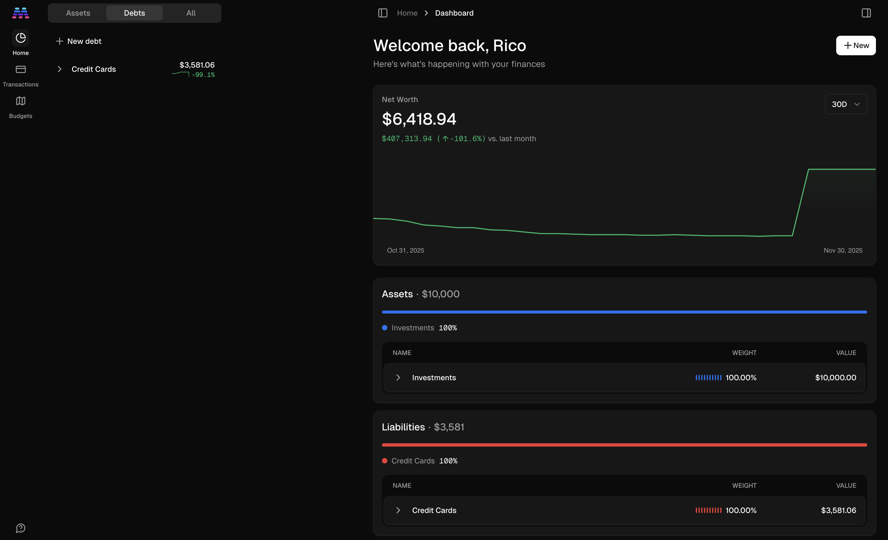
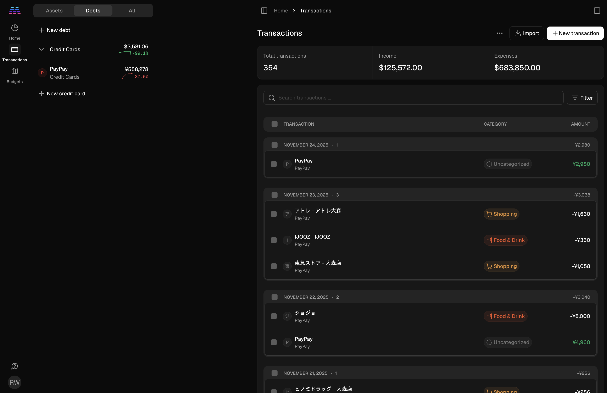
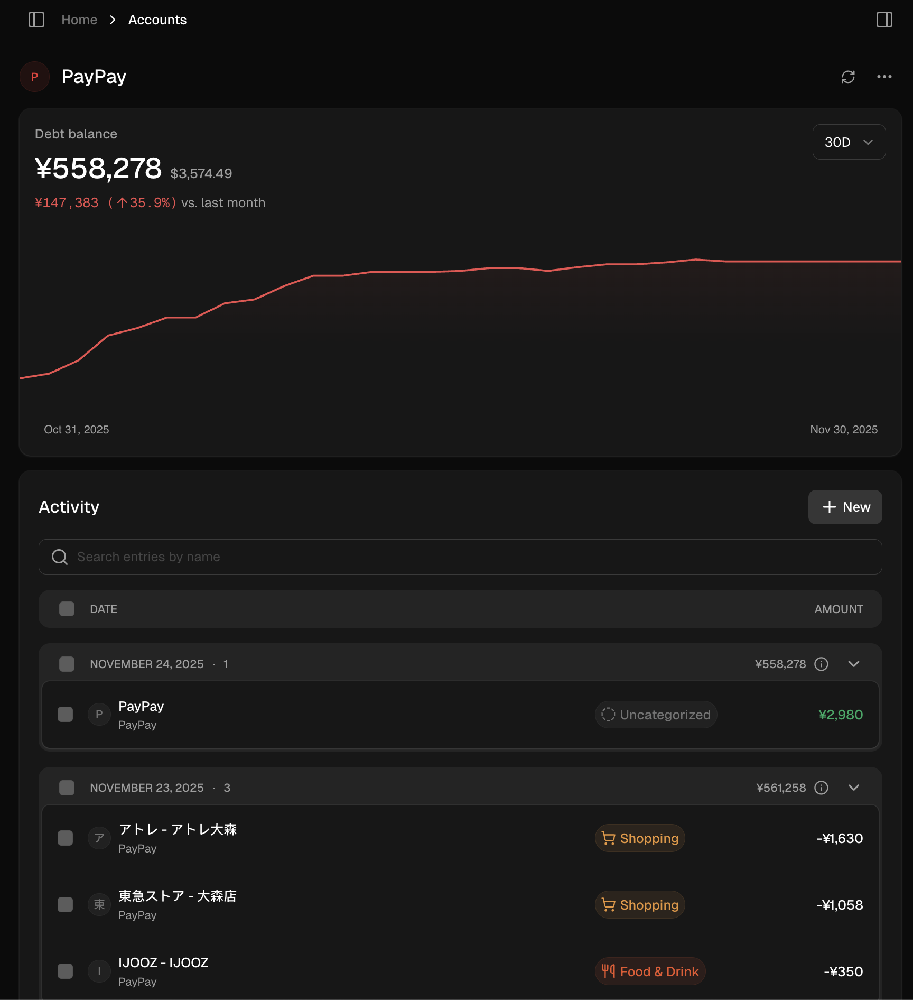

# FinApp Frontend PRD

## Overview
This document outlines the requirements and design breakdown for the FinApp frontend, based on the provided reference images. The goal is to create a modern, high-performance, dark-mode financial dashboard that provides a clear overview of net worth, assets, and liabilities, along with budgeting and transaction management.

## Visual References
- **Home/Dashboard**: 
- **Budgeting**: 
- **Transactions**: 
- **Transaction per Account**: 

## Component Breakdown

### 1. Sidebar Navigation
- **Tabs**: Top-level tabs for "Assets", "Debts", and "All" to filter the sidebar content.
- **Account Groups**: Collapsible sections for different account types (e.g., Investments, Credit Cards).
- **Account Items**:
    - Icon (e.g., Letter circle or brand logo).
    - Account Name and Type.
    - Balance and change percentage (with sparkline or color-coded text).
- **Actions**: "New account", "New investment", "New credit card" buttons at the bottom of each section.

### 2. Main Dashboard - Net Worth
- **Header**: Greeting (e.g., "Welcome back, Rico") and a prominent "+ New" button for global actions.
- **Net Worth Card**:
    - Current Net Worth value (large font).
    - Change value and percentage vs. last month (color-coded: green for positive, red for negative).
    - **Chart**: Line chart showing net worth over time.
        - X-axis: Dates (e.g., Oct 31 to Nov 30).
        - Y-axis: Value (implied, or hidden for cleaner look).
        - Tooltip on hover showing date and value.
    - **Time Range Selector**: Dropdown or tabs to select range (e.g., 30D, 90D, 1Y, All).

### 3. Assets & Liabilities Sections
- **Assets Card**:
    - Title: "Assets" with total value.
    - **Progress Bar**: Horizontal bar showing composition of assets (e.g., Blue for Investments).
    - **Table**:
        - Columns: Name, Weight (percentage), Value.
        - Collapsible rows for categories (e.g., Investments) showing sub-accounts.
        - Weight column shows a visual bar representation of the percentage.
- **Liabilities Card**:
    - Similar to Assets, but with a different color scheme (e.g., Red for Credit Cards).
    - Table showing credit card balances and weights.

### 4. Budgeting
- **Budget Overview**: Visual representation of budget vs actual spending.
- **Category Breakdown**: Detailed breakdown of spending by category.
- **Progress Bars**: Visual indicators for budget usage per category.

### 5. Transactions
- **Transaction List**: Comprehensive list of all transactions with columns for Date, Description, Category, and Amount.
- **Filtering & Search**: Ability to filter by account, category, date range, and search by description.
- **Account-Specific View**: Dedicated view for transactions within a single account, accessible from the sidebar or main dashboard.

## Potential Interactions & UX
- **Hover States**: All clickable elements (sidebar items, table rows, chart points) should have subtle hover effects.
- **Animations**:
    - Smooth transitions when expanding/collapsing sections.
    - Chart animations on load or range change.
    - Progress bar filling animation.
- **Responsiveness**: The layout should adapt to smaller screens (sidebar becoming a drawer, tables stacking).
- **Data Loading**: Skeleton loaders for cards and tables while data is fetching.

## Proposed Technical Stack
- **Framework**: Vite + React (for fast development and modern features).
- **Styling**: Tailwind CSS or Styled Components (Tailwind preferred for rapid prototyping and consistency).
- **Charts**: Recharts or Chart.js (Recharts is great for React).
- **Icons**: Lucide React or React Icons.
- **State Management**: React Query (for server state) and Zustand (for local state).

## Verification Plan
### Manual Verification
- Verify layout matches reference images on desktop.
- Verify hover states and animations.
- Verify responsiveness on mobile/tablet viewports.

