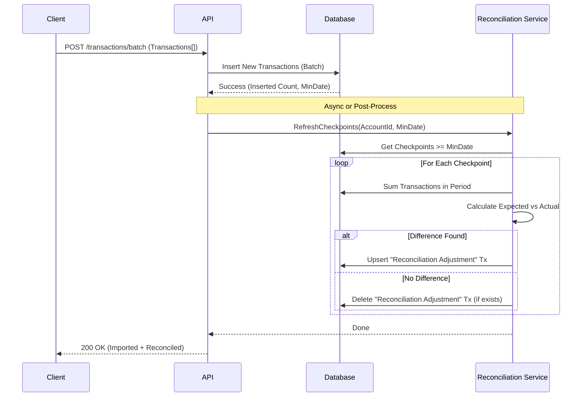

# Reconciliation Design Pattern

## Overview
This document outlines the design for handling retrospective reconciliation updates efficiently during batch transaction imports.

## Problem
When importing past transactions (e.g., from a bank statement), we might insert transactions into a period that has already been reconciled.
- **Current State**: The balance checkpoint for that period remains fixed, causing a discrepancy between the sum of transactions and the checkpoint balance.
- **Desired State**: The system should automatically detect this and update the "Adjustment Transaction" (or create one) for the affected reconciliation period to maintain the "plug".

## Proposed Solution: "Batch Reconciliation Refresh"

Instead of checking every single transaction during import (which is O(N)), we use a **Range-Based Refresh** strategy (O(M), where M is number of checkpoints).

### 1. The Import Flow
We introduce a new API endpoint or update the existing batch processor to handle this.



### 2. API Design

#### `POST /api/accounts/:accountId/transactions/batch`
**Request Body**:
```json
{
  "transactions": [ ... ]
}
```

**Response**:
```json
{
  "importedCount": 15,
  "reconciliationUpdates": {
    "checkpointsRefreshed": 2,
    "adjustmentsCreated": 1,
    "adjustmentsUpdated": 0
  }
}
```

### 3. Implementation Logic

#### Step A: Batch Insert
Insert transactions as usual. Keep track of the `minDate` of all *successfully inserted* (non-duplicate) transactions.

#### Step B: Identify Affected Checkpoints
Query `balance_checkpoints` for this account where `date >= minDate`.
- **Why?** Any checkpoint *after* an inserted transaction might now have an incorrect "Adjustment".
- **Optimization**: If `minDate` is after the latest checkpoint, no action is needed.

#### Step C: Recalculate Adjustments
For each affected checkpoint:
1.  **Define Period**:
    - `Start`: Date of previous checkpoint (or Epoch if none).
    - `End`: Date of current checkpoint.
2.  **Sum Transactions**: Calculate `Sum(Amount)` for all transactions in `(Start, End]`.
    - *Exclude* existing `RECONCILIATION` transactions for this checkpoint to avoid double counting.
3.  **Calculate Delta**:
    - `Expected = StartBalance + Sum`
    - `Delta = CheckpointBalance - Expected`
4.  **Upsert Adjustment**:
    - If `Delta != 0`: Create/Update a transaction of type `RECONCILIATION` with `amount = Delta` and `date = CheckpointDate`.
    - If `Delta == 0`: Delete existing `RECONCILIATION` transaction if it exists.

## Performance Considerations
- **Reads**: For each affected checkpoint, we need to sum transactions. This is a range query.
- **Writes**: Minimal (1 write per checkpoint max).
- **Scalability**: Since imports usually affect recent history, the number of affected checkpoints is small (usually 0 or 1). Even for full history imports, the number of checkpoints is manageable (e.g., 12 per year).

## Example Scenario
1.  **Jan 31**: Reconciled Balance $1000. (No adjustment).
2.  **Import**: User imports a forgotten transaction from **Jan 15** for -$50.
3.  **Trigger**: `minDate` is Jan 15.
4.  **Refresh**: System checks Jan 31 Checkpoint.
    - Previous Balance: $0 (Start).
    - Transactions Sum: $1000 (original) - $50 (new) = $950.
    - Target Balance: $1000.
    - Delta: $1000 - $950 = +$50.
5.  **Action**: Create `RECONCILIATION` transaction for +$50 on Jan 31.
    - Result: Net change to balance is 0 ($1000 - $50 + $50 = $1000). The checkpoint remains valid.
